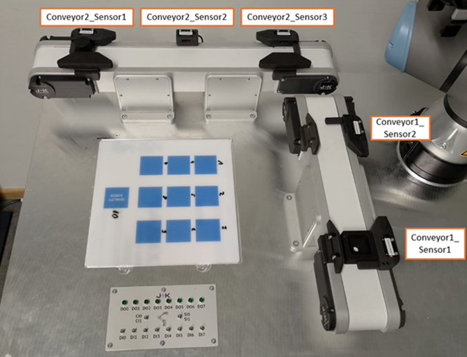

# industrial-manipulation-and-tracking

This repository contains a collection of hands-on robotics projects and lab exercises. The projects focus on industrial robot simulation, optical tracking, trajectory generation, and cobot programming, originally developed as part of the Robotics practicum at THWS.

## Projects Overview

### 1. KUKA Industrial Robot Simulation (RoboDK)

A complete simulation-to-reality workflow for a KUKA industrial robot. 
* Configured local object frames and tool center point (TCP) reference frames.
* Programmed pick-and-place operations and recovery routines safely inside RoboDK.
* Deployed the verified simulation onto physical KUKA hardware.

### 2. Kinematics & Collision Avoidance (MATLAB)
A motion planning project built around the KUKA LBR iiwa 7 using the MATLAB Robotics System Toolbox.
* Imported custom URDF models (like the `THWSGripper`) and attached them to the robot's end-effector link.
* Generated point-to-point trajectories using trapezoidal velocity profiles (`trapveltraj`).
* Implemented inverse kinematics (`ik`) to accurately position the TCP in the 3D workspace.
* Added collision checking between the robot, the work surface, and target objects to ensure safe grasping distances.

### 3. Motion Capture & Optical Tracking
Worked with an OptiTrack camera system to accurately track the pose (position and orientation) of mobile robots in real-time.
* Calibrated the multi-camera setup and established the global ground plane.
* Evaluated tracking precision under varying conditions, such as marker occlusion and external light interference.
* Logged and analyzed the trajectory of line-following robots, converting rotation data between Euler angles and Quaternions.

### 4. Cobot Material Handling

Programmed collaborative robots for advanced material handling tasks.
* **Conveyor Tracking:** Synchronized the cobot and gripper movements with moving conveyor belts to reliably pick up parts.
* **Force-Controlled Palletizing:** Utilized the robot's built-in force mode to detect parts physically rather than relying purely on visual sensors.
* Set up multi-layer palletizing routines and quality check logic using URCaps and scripting.
